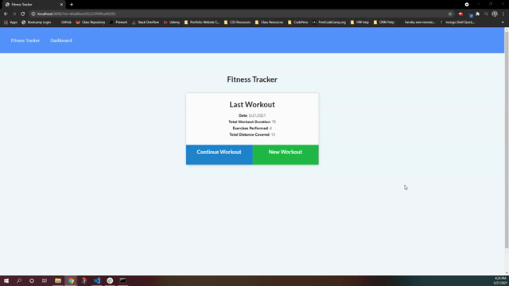

# Fitness Tracker

## Description

The Fitness Tracker allows users to track their cardio and resistance exercises within their workouts. The exercises the user adds to each workout is then displayed on the Dashboard page to show their progress over time.

## Technologies Used

This full-stack web application uses MongoDB, Mongoose, Express and NodeJS.

## Application Depoloyment

Click this link to take you to the deployed app: ADD LINK HERE KRISTEN

## Table of Contents

- [License](#license)
- [Contributions](#contributions)
- [Screenshot](#screenshot)
- [Questions](#questions)

## License

[MIT License Link](https://spdx.org/licenses/MIT.html)

## Contributions

Sole Author: Kristen Picard
https://github.com/kristenpicard

## Demo

## Questions

If you would like to discuss this project, please reach out via my GitHub:

GitHub: [Kristen Picard GitHub](https://github.com/kristenpicard)
